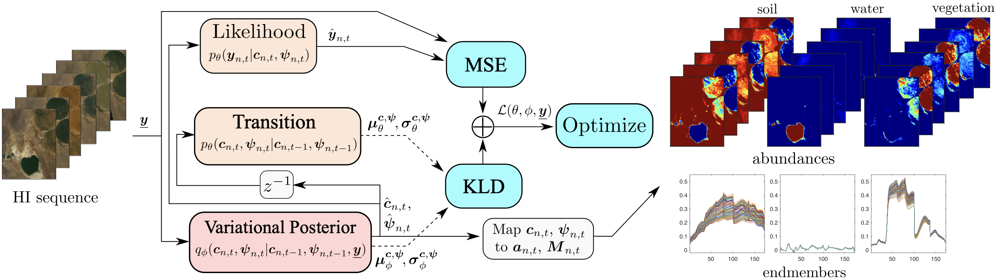

#  Dynamical Hyperspectral Unmixing with Variational Recurrent Neural Networks    #

This package contains the authors' implementation of ReDSUNN algorithm proposed in the paper [1].


Multitemporal hyperspectral unmixing (MTHU) reveals the dynamical evolution of the materials (endmembers) and of their proportions (abundances) in a scene. In this work, we propose an unsupervised MTHU algorithm based on variational recurrent neural networks accounting for the spatial and temporal variability of the endmembers using a low-dimensional parametrization. An MTHU algorithm based on deep variational inference is proposed to tackle the nonlinearity of the model, in which the posterior distribution of the estimated abundances and endmembers is represented using recurrent neural networks and a physically motivated model.





The code is implemented in Pytorch, and was adapted from [this repository](https://github.com/yjlolo/pytorch-deep-markov-model). The evaluation of the result via quantitative metrics and visualization is performed via MATLAB. 


## Usage

To reproduce the results of the paper, first run `train.py` with the appropriate json configuration file, for example:

    python train.py -c config_synth_ex1.json


The results are saved in `.mat` format in the `saved` folder. Then, you can evaluate the saved results with the corresponding Matlab function ```evaluate_results_ex1.m```.


### Downloading the datasets

The datasets are available in Zenodo [here](https://zenodo.org/record/7796598#.ZCt8VC8iuEc), https://doi.org/10.5281/zenodo.7796597. Please download them and include the correct paths to them in the .json files to be able to run the examples.


### Running with other data

To run the method with a different dataset, you need:  
-  `.mat` files with the hyperspectral image, and the reference/average endmember initialization (using VCA). 
-  a `.json` configuration file specifying the parameters of the method and the path to the data files (see examples `config_synth_ex1.json`, `config_synth_ex2.json` and `config_Tahoe.json`). 
-  a data loader files, stored in the `data_loader` folder. First, a data loader file has to be created according to the examples in `mydataloader_synth_ex1.py`, `mydataloader_synth_ex2.py` and `mydataloader_Tahoe.py`. Then, a corresponding dataloader class must be added to the file `data_loaders.py`. Note that the path to the .mat file containing the image is passed to the data loaders from the `.json` file.  
-  a Matlab file to evaluate the resulta, if desired, according to the examples `evaluate_results_ex1.m`, `evaluate_results_ex2.m`, `evaluate_results_ex_Tahoe.m`.  


## REFERENCE:
If you use this software please cite the following in any resulting publication:

    [1] Dynamical Hyperspectral Unmixing with Variational Recurrent Neural Networks
        R.A. Borsoi, T. Imbiriba, P Closas.
        IEEE Transactions on Image Processing, 2023.


